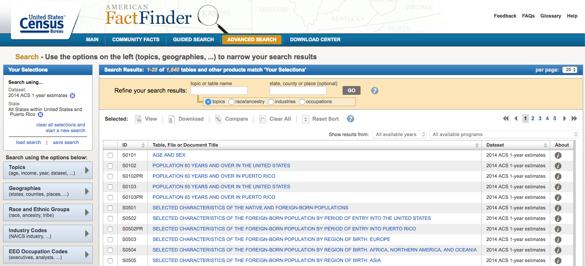
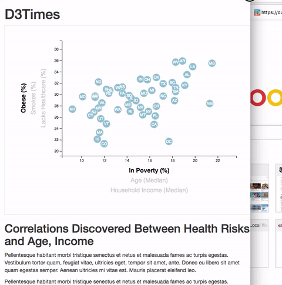

# Behavioral Risk Factor by Geographic Location

The purpose of this project is to analyze and visualize relationships between human behavior in terms of health risks affecting particular demographics. Data was collected from the U.S. Census Bureau and the Behavioral Risk Factor Surveillance System.

## Getting Started

These instructions will get you a copy of the project up and running on your local machine for development and testing purposes. See deployment for notes on how to deploy the project on a live system.

### Prerequisites

What things you need to install the software and how to install them

```
Give examples
```

### Installing

## Data Collection Process
Use the CSV file in the `data` directory.



To explore different relationships refer back to demographic information using the one-year estimates from the U.S. Census Burea's American Community Survey. It is also possible to specify your desired information using the [American FactFinder](http://factfinder.census.gov/faces/nav/jsf/pages/searchresults.xhtml) tool.

Search for data on health risks using survey data from the [Behavioral Risk Factor Surveillance System](https://chronicdata.cdc.gov/Behavioral-Risk-Factors/BRFSS-2014-Overall/5ra3-ixqq). Note that you need to filter the data by year to find the behavioral risk you want to use. Filter the `Question` data on the site before downloading a specified .csv, or simply download the whole .csv file and use Excel's filtering tools.

#### 2. How to Format and Test the Data

Let's format the data for D3. With the two data types chosen, grab the value columns from each and paste them into a new Excel document. Create header names tha can easily call with JavaScript. Make sure that the rows and columns line up.


To make sure there is a solid trend, you need to test for correlation with Excel's `=CORREL()` function. Aim for a value either less than -0.5 or more than 0.5—these values would indicate a moderate correlation.


* If there isn't a value that matches, try at least four other demographic-risk combinations. 

When a suitable match is found, delete any correlation cells from the sheet and save the file as `data.csv`. Place it in the `data` folder of this directory and move onto the next step.

#### 3. Visualize the Data

Using the D3 techniques, create scatter plots that represents each state with circle elements. Hold this code in the `app.js` file of the directory—make sure you pull in the data from `data.csv` by using the `d3.csv` function. The scatter plot should ultimately appear like the image at the top of this section.

* The x-values of the circles should match the demographic census data, while the y-values should represent the risk data.

* Generate this chart in the `d3.html` file in the directory.

* Note: You'll need to use `http-server` to display the graphic since you're pulling data in from a source outside of your app.js file.

#### 4. Embed into an iframe


## Visualizations





